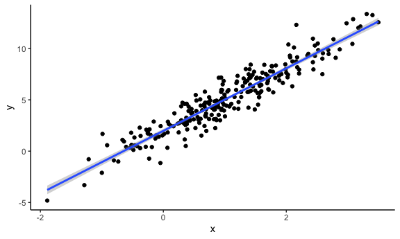
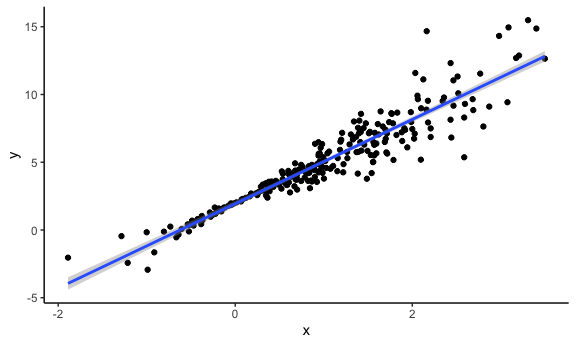
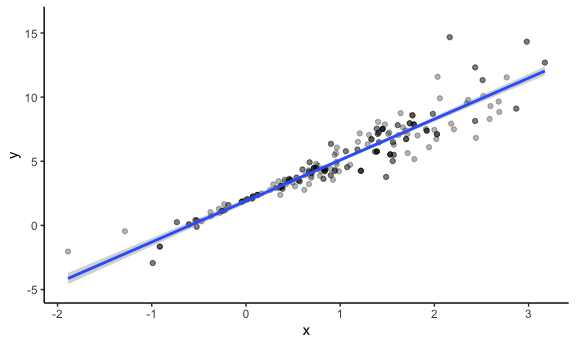

Bootsrapping
================

## Simulate data

``` r
n_samp = 250

sim_df_const = 
  tibble(
    x = rnorm(n_samp, 1, 1),
    error = rnorm(n_samp, 0, 1),
    y = 2 + 3 * x + error
  )

sim_df_nonconst = sim_df_const %>% 
  mutate(
  error = error * .75 * x,
  y = 2 + 3 * x + error
)
```

plot the datasets

``` r
sim_df_const %>% 
  ggplot(aes(x = x, y = y)) +
  geom_point() +
  geom_smooth(method = 'lm')
```

    ## `geom_smooth()` using formula 'y ~ x'



``` r
sim_df_nonconst %>% 
  ggplot(aes(x = x, y = y)) +
  geom_point() +
  geom_smooth(method = 'lm')
```

    ## `geom_smooth()` using formula 'y ~ x'



## Draw one bootstrap sample

``` r
boot_sample = function(df) {
  
  sample_frac(df, replace = TRUE) %>% 
    arrange(x)
  
}
```

Check if this works..

``` r
boot_sample(sim_df_nonconst) %>% 
  ggplot(aes(x = x, y = y)) +
  geom_point(alpha = .3) +
  geom_smooth(method = 'lm') +
  ylim(-5, 16)
```

    ## `geom_smooth()` using formula 'y ~ x'



``` r
boot_sample(sim_df_nonconst) %>% 
  lm(y ~ x, data = .) %>% 
  broom::tidy()
```

    ## # A tibble: 2 × 5
    ##   term        estimate std.error statistic   p.value
    ##   <chr>          <dbl>     <dbl>     <dbl>     <dbl>
    ## 1 (Intercept)     1.90    0.0982      19.3 2.45e- 51
    ## 2 x               3.14    0.0688      45.6 1.18e-122
