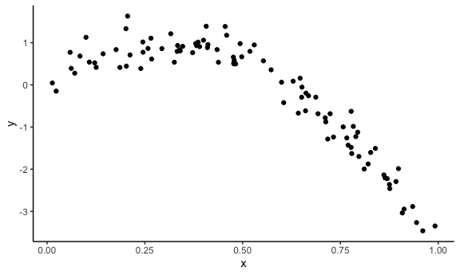
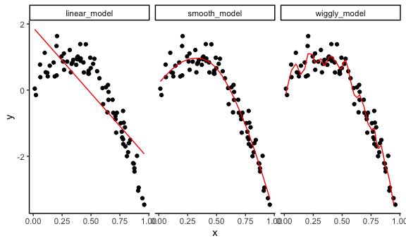
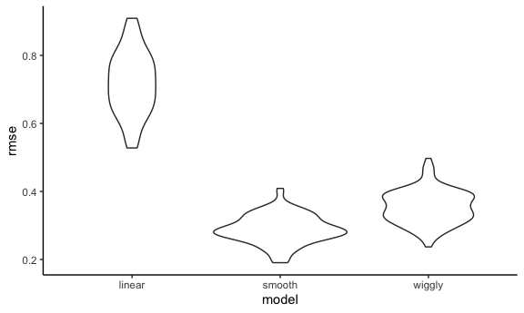
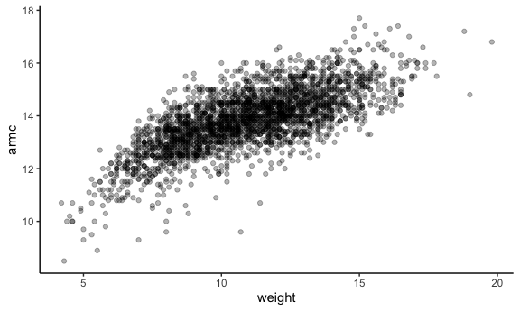
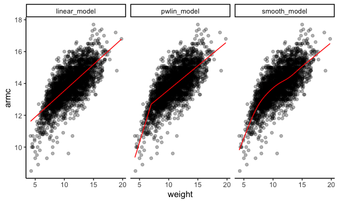
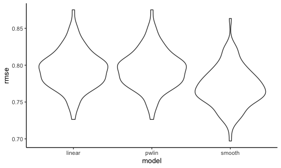

Cross Validation
================

## Simulate data

``` r
nonlin_df = 
  tibble(
    id = 1:100,
    x = runif(100, 0, 1),
    y = 1 - 10 * (x - .3) ^ 2 + rnorm(100, 0, .3)
  )
```

``` r
nonlin_df %>% 
  ggplot(aes(x = x, y = y)) + 
  geom_point()
```



## Cross validation – by hand

Get training and testing datasets

``` r
train_df = sample_n(nonlin_df, size = 80)
test_df = anti_join(nonlin_df, train_df, by = 'id')
```

Fit three models.

``` r
linear_model = lm(y ~ x, data = train_df)
smooth_model = gam(y ~ s(x), data = train_df)
wiggly_model = gam(y ~ s(x, k = 30), sp = 10e-6, data = train_df)
```

Can I see what i just did …

``` r
train_df %>% 
  gather_predictions(linear_model, smooth_model, wiggly_model) %>% 
  ggplot(aes(x = x, y = y)) +
  geom_point() +
  geom_line(aes(y = pred), color = 'red') +
  facet_grid(. ~ model)
```



Let’s look at the prediction accuracy.

``` r
rmse(linear_model, test_df)
```

    ## [1] 0.7052956

``` r
rmse(smooth_model, test_df)
```

    ## [1] 0.2221774

``` r
rmse(wiggly_model, test_df)
```

    ## [1] 0.289051

## Cross validation by using `modelr`

``` r
cv_df = 
  crossv_mc(nonlin_df, 100)
```

What is happening here…

``` r
cv_df %>% pull(train) %>% .[[1]] %>% as_tibble()
```

    ## # A tibble: 79 × 3
    ##       id      x       y
    ##    <int>  <dbl>   <dbl>
    ##  1     1 0.266   1.11  
    ##  2     2 0.372   0.764 
    ##  3     3 0.573   0.358 
    ##  4     4 0.908  -3.04  
    ##  5     6 0.898  -1.99  
    ##  6     7 0.945  -3.27  
    ##  7     8 0.661  -0.615 
    ##  8     9 0.629   0.0878
    ##  9    10 0.0618  0.392 
    ## 10    11 0.206   1.63  
    ## # … with 69 more rows

``` r
cv_df %>% pull(test) %>% .[[1]] %>% as_tibble()
```

    ## # A tibble: 21 × 3
    ##       id      x      y
    ##    <int>  <dbl>  <dbl>
    ##  1     5 0.202   1.33 
    ##  2    12 0.177   0.836
    ##  3    19 0.380   0.982
    ##  4    22 0.212   0.710
    ##  5    28 0.382   0.932
    ##  6    31 0.482   0.498
    ##  7    37 0.794  -1.12 
    ##  8    42 0.647   0.158
    ##  9    47 0.0233 -0.148
    ## 10    56 0.0995  1.13 
    ## # … with 11 more rows

``` r
cv_df =
  cv_df %>% 
  mutate(
    train = map(train, as.tibble),
    test = map(test, as.tibble)
  )
```

    ## Warning: `as.tibble()` was deprecated in tibble 2.0.0.
    ## ℹ Please use `as_tibble()` instead.
    ## ℹ The signature and semantics have changed, see `?as_tibble`.
    ## ℹ The deprecated feature was likely used in the purrr package.
    ##   Please report the issue at <]8;;https://github.com/tidyverse/purrr/issueshttps://github.com/tidyverse/purrr/issues]8;;>.

Let’s try to fit models and get RMSEs for them.

``` r
cv_df = 
  cv_df %>% 
  mutate(
    linear_model = map(.x = train, ~lm(y ~ x, data = .x)),
    smooth_model = map(.x = train, ~gam(y ~ s(x), data = .x)),
    wiggly_model = map(.x = train, ~gam(y ~ s(x, k = 30), sp = 10e-6, data = .x))
  ) %>% 
  mutate(
    rmse_linear = map2_dbl(.x = linear_model, .y = test, ~rmse(model = .x, data = .y)),
    rmse_smooth = map2_dbl(.x = smooth_model, .y = test, ~rmse(model = .x, data = .y)),
    rmse_wiggly = map2_dbl(.x = wiggly_model, .y = test, ~rmse(model = .x, data = .y)),
  )
```

What do these results say about the model choices?

``` r
cv_df %>% 
  select(starts_with("rmse")) %>% 
  pivot_longer(
    everything(),
    names_to = "model",
    values_to = "rmse",
    names_prefix = "rmse_"
  ) %>% 
  ggplot(aes(x = model, y = rmse)) +
  geom_violin()
```



Computing averages…

``` r
cv_df %>% 
  select(starts_with("rmse")) %>% 
  pivot_longer(
    everything(),
    names_to = "model",
    values_to = "rmse",
    names_prefix = "rmse_"
  ) %>% 
  group_by(model) %>% 
  summarize(ave_rmse = mean(rmse))
```

    ## # A tibble: 3 × 2
    ##   model  ave_rmse
    ##   <chr>     <dbl>
    ## 1 linear    0.718
    ## 2 smooth    0.289
    ## 3 wiggly    0.354

## Try on a real dataset.

Import the data.

``` r
child_growth_df = 
  read_csv("./data/nepalese_children.csv") %>% 
  mutate(
    weight_cp = (weight > 7) * (weight - 7)
  )
```

    ## Rows: 2705 Columns: 5
    ## ── Column specification ────────────────────────────────────────────────────────
    ## Delimiter: ","
    ## dbl (5): age, sex, weight, height, armc
    ## 
    ## ℹ Use `spec()` to retrieve the full column specification for this data.
    ## ℹ Specify the column types or set `show_col_types = FALSE` to quiet this message.

weight vs arm circumference

``` r
child_growth_df %>% 
  ggplot(aes(x = weight, y = armc)) +
  geom_point(alpha = .3)
```



Fit the models I care about.

``` r
linear_model = lm(armc ~ weight, data = child_growth_df)
pwlin_model = lm(armc ~ weight + weight_cp, data = child_growth_df)
smooth_model = gam(armc ~ s(weight), data = child_growth_df)
```

``` r
child_growth_df %>% 
  gather_predictions(linear_model, pwlin_model, smooth_model) %>% 
  ggplot(aes(x = weight, y = armc)) +
  geom_point(alpha = .3) +
  geom_line(aes(y = pred), color = 'red') +
  facet_grid(. ~ model)
```



Try to understand model fit using CV.

``` r
cv_df = 
  crossv_mc(child_growth_df, 100) %>% 
  mutate(
    train = map(train, as_tibble),
    test = map(test, as_tibble)
  )
```

See if i can fit the models to the splits

``` r
cv_df =
  cv_df %>% 
  mutate(
    linear_model = map(.x = train, ~lm(armc ~ weight, data = .x)),
    pwlin_model = map(.x = train, ~lm(armc ~ weight, data = .x)),
    smooth_model = map(.x = train, ~gam(armc ~ s(weight), data = .x))
  ) %>% 
  mutate(
    rmse_linear = map2_dbl(.x = linear_model, .y = test, ~rmse(model = .x, data = .y)),
    rmse_pwlin = map2_dbl(.x = pwlin_model, .y = test, ~rmse(model = .x, data = .y)),
    rmse_smooth = map2_dbl(.x = smooth_model, .y = test, ~rmse(model = .x, data = .y))
  )
```

``` r
cv_df %>% 
  select(starts_with("rmse")) %>% 
  pivot_longer(
    everything(),
    names_to = "model",
    values_to = "rmse",
    names_prefix = "rmse_"
  ) %>% 
  ggplot(aes(x = model, y = rmse)) +
  geom_violin()
```


